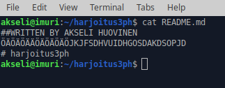
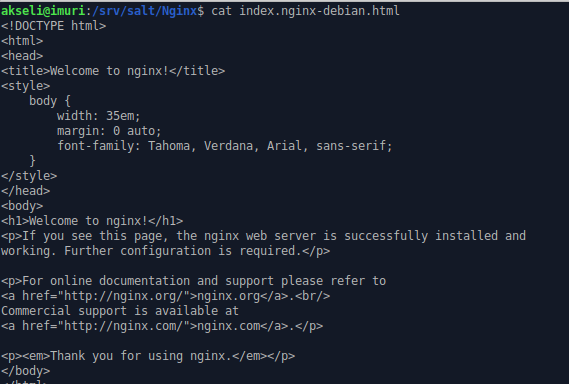

# Harjoitus 3, Versionhallinta ja MarkDown

**Kurssi:** http://terokarvinen.com/2020/configuration-managment-systems-palvelinten-hallinta-ict4tn022-spring-2020/

**a) MarkDown. Tee tämän tehtävän raportti MarkDownina. Helpointa on tehdä raportti GitHub-varastoon, jolloin md-päätteiset tiedostot muotoillaan automaattisesti. Tyhjä rivi tekee kappalejaon, risuaita ‘#’ tekee otsikon, sisennys merkitsee koodinpätkän.**

Käyttämiäni ohjeita MarkDownin opetteluun: 
https://www.markdownguide.org/basic-syntax/ https://guides.github.com/features/mastering-markdown/

Aloitin harjoituksen asentamalla itselleni Gedit-tekstieditorin, jolla päätin kirjoittaa raportin.

`Sudo apt-get -y install gedit`

Aloitin raportin kirjoittamisen komennolla `gedit harjoitus3.md`.

Tämän jälkeen menin GitHubiin (Github.com) tekemään harjoitusta varten uuden repositorion

Uuden repon nimeksi laitoin "harjoitus3ph".Tein repositoriosta julkisen sekä valitsin "Initialize this repository with a README" ja lisenssiksi GNU General Public License.

Luomisen jälkeen kloonasin uuden repositorioni omalle koneelleni:

`git clone https://github.com/HuoAks/harjoitus3ph`

Komento kopioi koko repositorion käyttäjäni kotihakemistoon.

`cd harjoitus3ph/`
Tässä vaiheessa siirsin raporttini uuteen hakemistooni:

`mv harjoitus3.md harjoitus3ph`
 
Käytin komentoja`git add .` ja `git commit` tallentaakseni repoon tekemäni muutokset. Tämän jälkeen komennolla `git push`lisäsin commitin GitHubiin

Törmäsin pieniin ongelmiin kuvien lisäämisessä MarkDown-tiedostooni ja  sen seurauksena tein useamman commitin sekä pushin. Työskentelyä helpottaakseni nappasin Tero Karvisen [ohjeesta](http://terokarvinen.com/2016/publish-your-project-with-github) komennon `git config --global credential.helper "cache --timeout=3600"`, jonka avulla Git muistaa kirjautumistiedot tunnin ajan eikä salasanaa tarvita jokaisen pushin yhteydessä.

GitHubissa tilanne näytti ensimmäisten kommittien jälkeen seuraavalta:

**d) Näytä omalla git-varastollasi esimerkit komennoista ‘git log’, ‘git diff’ ja ‘git blame’. Selitä tulokset.**

`git log` komento tulostaa lokin kaikista repositorioon tehdyistä kommiteista.

Formaatista näkyy jokaisen kommitin oma token, author, timestamp sekä kommittiin lisätty viesti.

`git diff` komento näyttää eroavaisuudet paikallisen repositorion sekä GitHubissa olevan välillä.

Tässä tapauksessa raporttitiedostossani näkyy uusia rivejä, joita ei ole vielä pushattu GitHubiin. Uudet rivit on merkitty +-merkillä.

`git blame` komennolla voidaan esimerkiksi tarkastella jotain tiettyä repositorion tiedostoa ja katsoa rivikohtaisesti, kuka on kirjoittanut/kommittanut mitäkin. Annoin siis komennon `git blame harjoitus3.md` tarkastellakseni raportti-tiedostoani.

Tulosteeseen tulee jokaiselta tiedoston riviltä muokkauksen timestamp, author sekä rivin sisältö tottakai. Kuvassa näkyy
raporttiin kirjoittamiani rivejä. 

**e) Tee tyhmä muutos gittiin, älä tee commit:tia. Tuhoa huonot muutokset ‘git reset –hard’. Huomaa, että tässä toiminnossa ei ole peruutusnappia.**

Muokkasin repositorioni README-tiedostoa lisäämällä sinne sekavaa tekstiä.

Annoin komennon `git reset --hard`, joka palauttaa repositorion tiedostot edellisen kommitin tilanteeseen.

**f) Tee uusi salt-moduli. Voit asentaa ja konfiguroida minkä vain uuden ohjelman: demonin, työpöytäohjelman tai komentokehotteesta toimivan ohjelman. Käytä tarvittaessa ‘find -printf “%T+ %p\n”|sort’ löytääksesi uudet asetustiedostot. (Tietysti eri ohjelma kuin aiemmissa tehtävissä, tarkoitushan on harjoitella Salttia)**

Tehtävä varten minulla oli toimiva salt mater-slave asetelma valmiina.

Päätin asentaa Nginx-weppipalvelimen ja muokata, jotain siihen liityvää asetusta tai tiedostoa Saltin avulla. Lähde: https://www.nginx.com/resources/wiki/start/

Aluksi asensin paketin käsin: `sudo apt-get -y install nginx` Asennuksen yhteydessä Nginx-demoni ei kuitenkaan käynnistynyt ja virheilmoituksia tarkastellessani huomasin, että tarvittava portti 80 oli Apachen käytössä.

Annoin komennon `sudo systemctl stop apache2.service` vapauttaakseni portin ja komennolla `sudo systemctl restart nginx` sain Nginx:n käynnistettyä.

Aluksi localhost osoitteeseen tuli näkyviin minun aikaisemmin muokkaamani index.html. Halusin Nginx:n default-sivun localhostiin (index.nginx-debian.html), joten poistin index.html:n -> `sudo rm index.html`.

Sain Nginx:n default-sivun näkyville localhostiin.

Seuraavaksi suuntasin /etc/nginx-hakemistoon tarkastelemaan Nginx:n asetustiedostoja. Asetustiedostot olivat odotetussa paikassa eli find-komennolle ei tässä vaiheessa tullut käyttöä. Nginx on minulle täysin uusi demoni, joten pääsin pysytellä tässä vaihessa asentamisessa enkä alkanut konfiguroimaan sen enempää.

Tässä vaiheessa testasin, että Salt toimii. `sudo salt 'testiminion cmd.run 'hostname -I'`

Pysäytin myös Apachen, joka oli minionilleni asennettuna. 

Seuraavaksi loin masterin /srv/salt-hakemistoon kansion "Nginx" ja sinne kopion index.nginx-debian.html-tiedostosta, jota aioin käyttää sourcena tilalla tekemilläni muutoksilla.`sudo mkdir Nginx` `sudo cp /var/www/html/index.nginx-debian.html index.nginx-debian.html`

Sitten kansioon init.sls-tiedosto, jonne tein funktiot: pkg.installed, file.managed ja service.running.

`sudo salt 'testiminion' state.apply Nginx`

Tulos oli odotusten mukainen, eli Nginx asentui minionille, mutta tiedostoon ei tarvinnut tehdä muutoksia, sillä en ollut muokannut masterin source-tiedostoa.

Hain minionin selaimella Localhost, mutta siellä oli samainen aikaisemmin apache2 konfiguroidessani muokattu index.html, jonka päätin myöskin poistaa. Sitten localhostiin ilmestyi Nginx:n default-sivu.

Tässä vaiheessa muokkasin masterin /srv/salt-hakemiston index-tiedostoa.

Muokkauksen jälkeen uudelleen `sudo salt 'testiminion' state.apply Nginx`

Tulos oli haluttu ja tiedoston muokkaus saltin välityksellä näytti onnistuneen. Tarkastin asian vielä minionin selaimella.

Jätin Nginx:n/Saltin opettelun tältä erää tähän.

**Lähteet:**

Tero Karvinen, 2020: http://terokarvinen.com/2020/configuration-managment-systems-palvelinten-hallinta-ict4tn022-spring-2020/ Luettu 19.4.2020

Tero Karvinen, 2016: http://terokarvinen.com/2016/publish-your-project-with-github Luettu 19.4.2020

Markdownguide.org: https://www.markdownguide.org/basic-syntax/ https://guides.github.com/features/mastering-markdown/ Luettu 19.4.2020

Guides.github.com: https://guides.github.com/features/mastering-markdown/ Luettu 19.4.2020

Nginx.com: https://www.nginx.com/resources/wiki/start/ Luettu 20.4.2020

