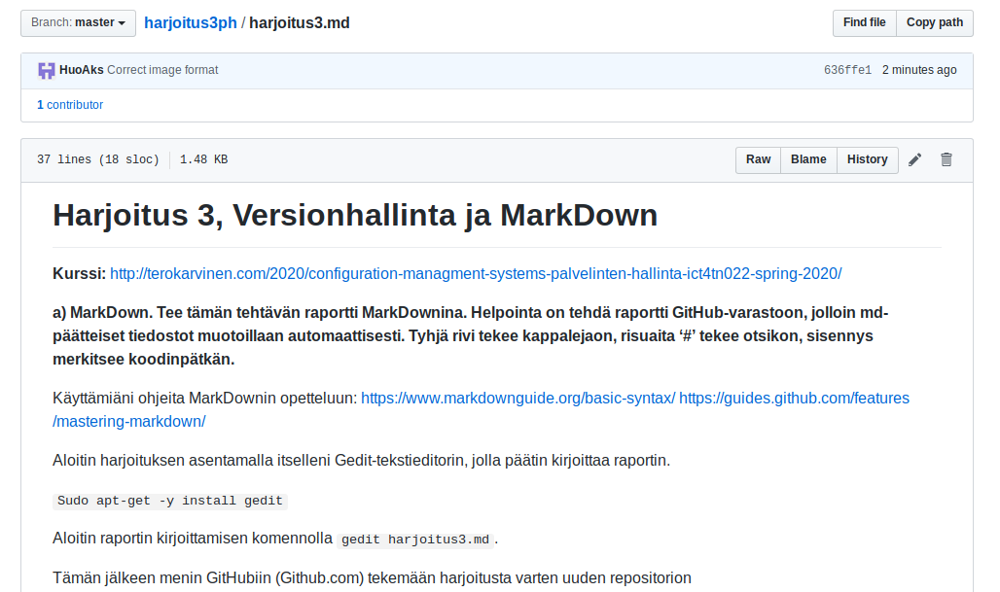

# Harjoitus 3, Versionhallinta ja MarkDown

**Kurssi:** http://terokarvinen.com/2020/configuration-managment-systems-palvelinten-hallinta-ict4tn022-spring-2020/

**a) MarkDown. Tee tämän tehtävän raportti MarkDownina. Helpointa on tehdä raportti GitHub-varastoon, jolloin md-päätteiset tiedostot muotoillaan automaattisesti. Tyhjä rivi tekee kappalejaon, risuaita ‘#’ tekee otsikon, sisennys merkitsee koodinpätkän.**

Käyttämiäni ohjeita MarkDownin opetteluun: 
https://www.markdownguide.org/basic-syntax/ https://guides.github.com/features/mastering-markdown/

Aloitin harjoituksen asentamalla itselleni Gedit-tekstieditorin, jolla päätin kirjoittaa raportin.

`Sudo apt-get -y install gedit`

Aloitin raportin kirjoittamisen komennolla `gedit harjoitus3.md`.

Tämän jälkeen menin GitHubiin (Github.com) tekemään harjoitusta varten uuden repositorion

Uuden repon nimeksi laitoin "harjoitus3ph".Tein repositoriosta julkisen sekä valitsin "Initialize this repository with a README" ja lisenssiksi GNU General Public License.

Luomisen jälkeen kloonasin uuden repositorioni omalle koneelleni:

`git clone https://github.com/HuoAks/harjoitus3ph`

Komento kopioi koko repositorion käyttäjäni kotihakemistoon.

`cd harjoitus3ph/`
Tässä vaiheessa siirsin raporttini uuteen hakemistooni:

`mv harjoitus3.md harjoitus3ph`
 
Käytin komentoja`git add .` ja `git commit` tallentaakseni repoon tekemäni muutokset. Tämän jälkeen komennolla `git push`lisäsin commitin GitHubiin

Törmäsin pieniin ongelmiin kuvien lisäämisessä MarkDown-tiedostooni ja  sen seurauksena tein useamman commitin sekä pushin. Työskentelyä helpottaakseni nappasin Tero Karvisen [ohjeesta](http://terokarvinen.com/2016/publish-your-project-with-github) komennon `git config --global credential.helper "cache --timeout=3600"`, jonka avulla Git muistaa kirjautumistiedot tunnin ajan eikä salasanaa tarvita jokaisen pushin yhteydessä.

GitHubissa tilanne näytti ensimmäisten kommittien jälkeen seuraavalta:

**d) Näytä omalla git-varastollasi esimerkit komennoista ‘git log’, ‘git diff’ ja ‘git blame’. Selitä tulokset.**

`git log` komento tulostaa lokin kaikista repositorioon tehdyistä kommiteista.

Formaatista näkyy jokaisen kommitin oma token, author, timestamp sekä kommittiin lisätty viesti.

`git diff` komento näyttää eroavaisuudet paikallisen repositorion sekä GitHubissa olevan välillä.

Tässä tapauksessa raporttitiedostossani näkyy uusia rivejä, joita ei ole vielä pushattu GitHubiin. Uudet rivit on merkitty +-merkillä.

`git blame` komennolla voidaan esimerkiksi tarkastella jotain tiettyä repositorion tiedostoa ja katsoa rivikohtaisesti, kuka on kirjoittanut/kommittanut mitäkin. Annoin siis komennon `git blame harjoitus3.md` tarkastellakseni raportti-tiedostoani.

Tulosteeseen tulee jokaiselta tiedoston riviltä muokkauksen timestamp, author sekä rivin sisältö tottakai.Kuvassa näkyy
raporttiin kirjoittamiani rivejä. 
